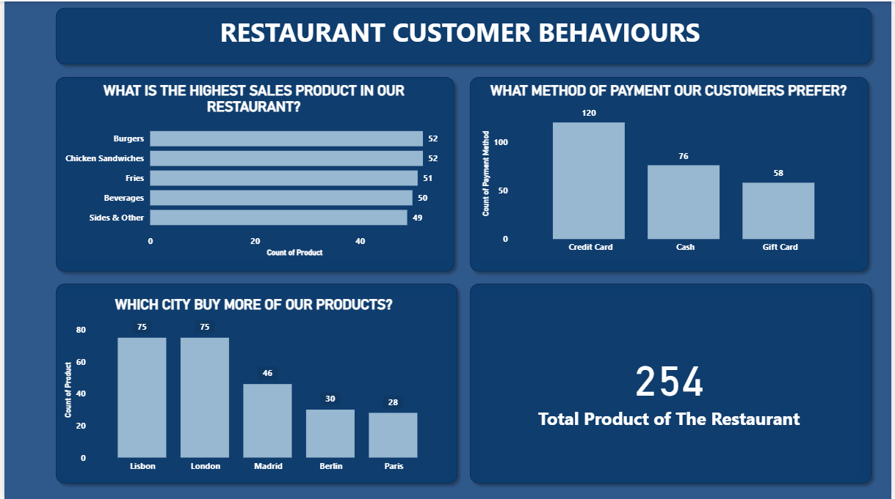

# 🍽️ Restaurant Sales Dashboard

## 📊 Project Overview
This project presents a Restaurant Sales Dashboard created to analyze sales performance and customer behavior in a restaurant.

The dashboard helps answer important business questions such as which products generate the highest sales, the payment methods customers prefer, and the cities where most purchases are made.

This project demonstrates skills in data analysis, visualization, and business insight generation.

---

## 🎯 Project Objectives
The dashboard answers the following key questions:

- What is the **highest sales product** in the restaurant?
- What **payment method do customers prefer**?
- Which **city buys the most products**?
- What is the **total number of products available** in the restaurant?

---

## 📁 Dataset Description
The dataset contains restaurant sales information including:

- Product name  
- Sales amount  
- Payment method  
- Customer city  
- Product category  
- Order details  

The data was cleaned and prepared before creating the dashboard.

---

## 🛠 Tools Used
- **Power BI** – Dashboard development and visualization  
- **Excel / SQL** – Data cleaning and preparation  
- **GitHub** – Project documentation  

---

## 📈 Dashboard Features

### Highest Sales Product
A **bar chart** showing the products with the highest sales in the restaurant.

### Payment Method Preference
A **bar chart** showing the payment methods customers prefer.

### City with Highest Purchases
A **bar chart** identifying which cities purchase the most products.

### Total Products
A **card visualization** showing the total number of products available in the restaurant.

---

## 📷 Dashboard Preview
Add your dashboard screenshot here.

Example:

---

## 🔍 Key Insights
Some insights from the dashboard include:

- Certain products generate **significantly higher sales** than others.
- Customers show a clear **preference for specific payment methods**.
- Some cities contribute **more sales compared to others**.

---

## 🚀 Project Purpose
This project is part of my journey to becoming a **Data Analyst**.  
I am building practical data projects to improve my skills in data analysis, dashboard creation, and storytelling with data.

---

⭐ If you found this project useful, feel free to give the repository a star!
